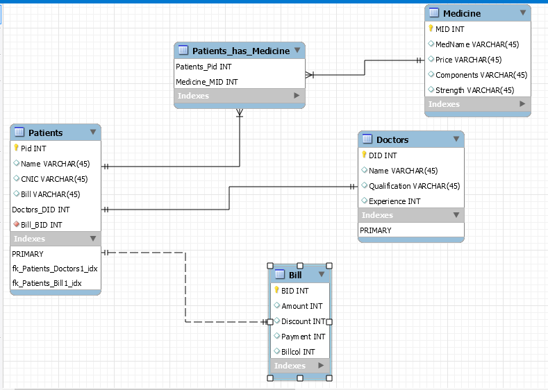

# Hospital-management-system

 <video width="320" height="240" controls>
  <source src="animation.mp4" type="video/mp4">
</video>
## ABSTRACT
Our project is of hospital management system has following features

A program that will guide you according to the needs\
Patient condition\
Fee requirements\
Availability of doctor\
No of persons waiting in the list\
Facility of medicine if patients is willing\  
Final bill\

Following are the data structures which we have used\
Trees\
Arrays\
To save the information of the patient visited we have used file handling. Firstly it asks the patient if he is in a state of emergency or normal state. Then it asks the Patient cnic, name. Then it asks which the patient that which type of disease he is suffering from so that he send the patient to the specific doctor. We have used sleep function so that if there is already a patient with doctor the patient outside waits for his entry. If the patients wants to take medicine from same hospital he can take it’s up to the patient several medicines are available for each disease. In the end it calculates the total bill.  There is also a manager mode it requires a secret 4 digit pin to access. It has record of the patients who have visited that day. Some improvements could be made to make it better by saving the information using if stream. Secondly we could also have used password instead of pin number.

## INTRODUCTION
Our problem statement is To Make an Automated User friendly Hospital Management System that provides complete guidance to Patient.
For this purpose we implemented Data Structures and Algorithms techniques to make our respected user friendly program. We implemented our program with the help of:\
    1. Linked Lists\
    2. Binary Trees\
    3. Arrays\
With the help of this program a user will:\
    1. Register himself as a normal patient or emergency patient\
    2. Give program necessary credentials like name, Id number to get registered\
    3. Get appointment to the doctor according to the disease he is suffering from\
    4. Purchase medicines of his choice\
    5. Saves a list of visited patients if he logged in as a ‘Manager” in the program\
For saving the list of patients we used the concept of file handling. This program can be implemented on small scale hospital sector for its creativity. It provides a patient to select a particular disease from which he is suffering as well as a Manager can save a list of patients visited on a particular day.
## Implementation
### Time Complexity
Time complexity of Linked Lists: O(n)\
Time complexity of Binary trees: O(nlogn)\
Hence the overall time complexity of this program is: O(n) where n is the number of patients registered.
### Data structures used:
Main structure of program was implemented using the concept of Binary trees. We designated specific program to run for each node of tree. We implemented this structure using post order traversal of Binary Tree.\
We chose binary trees for this purpose because we wanted to implement the whole program using all the major techniques of Data structures.
### 1) Linked List implementation:
Basically we have implemented the concept of singly linked list in our project. The concept behind the use of linked list is solely the registry of patient. As we are aware of the fact that in a linked list a node data structure is created with a few basic attributes and pointer pointing to other nodes, likewise the implementation of linked list is done in the same suit thereby making a data structure node i.e. of patients having unique attributes including name, serial no, bill along with the pointers. Furthermore we have used the concept of class here.
### 2) Binary Tree implementation:
As mentioned above the binary tree implementation has been done in a quite exciting way. We have used to concept of tree traversal in which we have implemented DFS (Depth First) “Pre-order” algorithm, the underlying objective is the use the tree data structure in such a way that each major function in the code or each step in the hospital management system that patient will come across is carried through the node traversal, for this purpose we have created 5 nodes along with tree data structure and also each function that will be called, has been linked to a specific node.
### 3) Array implementation:
The concept of array has also been used a number of times in this project.\
For example:\
BILL of the patient\
String array for the name of patients etc\
Registration of Patient was implemented using arrays. Programs will ask user to enter his condition (Normal or Emergency). After that he will enter his name, Id and will specify his disease and then he’ll be proceeded to respected doctor for checkup. Then the program will ask the user if he want to purchase medicine or not. This all is done for one patient using arrays and linked lists. Each array index points the particular patient and we initialized Linked List for each array index which will store his Name, Id, Disease and bill etc.\
We chose these structures for this task because it is more simple and efficient and we can easily traverse through the whole list using arrays. In this way we can also access their respected credentials.\
Manager mode is the mode in which a program asks a user to enter a pin code to log in to manager portal. The user will be given 4 tries before the program will shut down automatically if he failed to enter the correct pin code. After logging into this portal user will be asked whether he wants to save visited patient list or not. The List will be saved to respected location.  
### Results
This project, demonstrating the management in Hospital, is limited to serving a single patient at a time as it was the 1st generation version of our attempt at it. The time complexity of the program is Big-O (N) which is quite good in case of a small hospital.\
The system can be used at a hospital which is for a not-so-busy hospital at the moment we have a single doctor at the duty and there is a waiting mechanism for patients.
### Discussion & Conclusion
As for its further extension, we can implement a system which has the possibility that if a doctor is busy with medication examination of a patient, for a next patient to come, the system could direct him to another specialist’s supervision. So, if any patient comes, the program checks for the first doctor. If he is busy, it asks the different doctor and so on.\
Another possibility is that, if a limited number of doctors are available, a queue can be implemented which allow the serving of patients on first come, first serve basis i.e. the first patient to come get the first priority to be examined by doctor, the second to come gets the second priority and so on. So even if one doctor is available only, a queue would allow us to have a robust system.\
 Moreover, we can introduce to our program, a report producer at the end of examinations. The report will show all the tests taken by patient and their results with deviation from a normal patient’s result. The details of the patient, his name, contact, address and medical details would also be shown on report such as his blood group etc.

